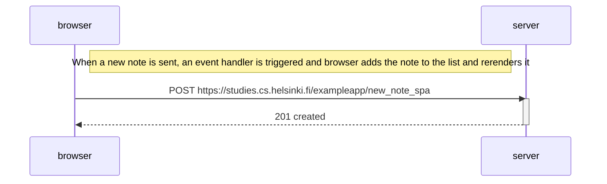

```mermaid
sequenceDiagram
    participant browser
    participant server

    Note right of browser: When a new note is sent, an event handler is triggered and browser adds the note to the list and rerenders it

    browser->>server: POST https://studies.cs.helsinki.fi/exampleapp/new_note_spa
    activate server
    server-->>browser: 201 created
    deactivate server

```
